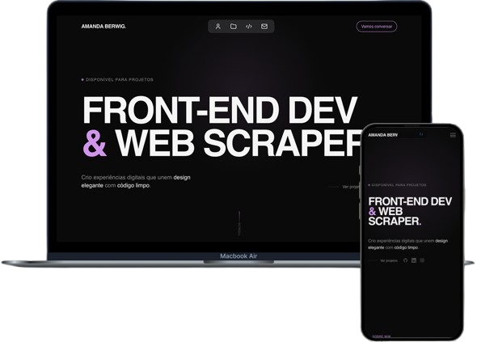

 <h1 align="center"> Portfolio v2.0</h1> 

Este é o meu portfólio pessoal, desenvolvido para apresentar meus projetos, habilidades e experiências como desenvolvedora. O design é moderno, responsivo e inspirado no estilo do Sawad.framer.website.
---


---

### Tecnologias Utilizadas

- **Next.js 14**
- **React**
- **TypeScript**
- **Tailwind CSS**
- **Resend** – Envio de e-mails pelo formulário de contato
- **Vercel** – Deploy e hospedagem
- **Intersection Observer API** – Animações ao rolar a página

---

### Como Executar o Projeto
 Clone o repositório
```bash

git clone https://github.com/seu-usuario/seu-portfolio.git
cd seu-portfolio

- Instale as dependências
npm install

- Configure as variáveis de ambiente
Crie um arquivo .env.local na raiz do projeto:
RESEND_API_KEY=your_resend_api_key

- Execute o projeto
npm run dev

Acesse em: http://localhost:3000

-  Deploy: [()]
